# Lista Doblemente Enlazada con Cabeza y Cola — Gestión de Clientes

Proyecto en **Java** que implementa una **lista doblemente enlazada** con referencias a
**cabeza** y **cola** para guardar y administrar clientes.

---

## Índice

1. [Enunciado del problema](#1-enunciado-del-problema)
2. [Archivos del proyecto](#2-archivos-del-proyecto)
3. [Cómo clonar el repositorio y trabajar con Git](#3-cómo-clonar-el-repositorio-y-trabajar-con-git)
4. [Cómo compilar y ejecutar](#4-cómo-compilar-y-ejecutar)
5. [Conceptos fundamentales](#5-conceptos-fundamentales)
6. [Anatomía del nodo: la clase `Cliente`](#6-anatomía-del-nodo-la-clase-cliente)
7. [La clase `ListaDoble`](#7-la-clase-listadoble)
8. [Operación por operación (con diagramas)](#8-operación-por-operación-con-diagramas)
9. [Los cálculos estadísticos](#9-los-cálculos-estadísticos)
10. [Flujo del programa (`Main`)](#10-flujo-del-programa-main)
11. [Ejemplo de ejecución real](#11-ejemplo-de-ejecución-real)
12. [Costo de cada operación](#12-costo-de-cada-operación)
13. [Preguntas frecuentes](#13-preguntas-frecuentes)

---

## 1. Enunciado del problema

> Implementar una lista doblemente enlazada con referencias **cabeza** y **cola** que
> almacene datos de clientes. Cada cliente tiene: **código** (String), **nombre** (String),
> **edad** (int) y **crédito** (float).
>
> Operaciones requeridas:
>
> - Insertar un nuevo cliente al final de la lista.
> - Mostrar todos los clientes.
> - Actualizar los datos de un cliente buscándolo por código.
> - Eliminar un cliente por código, ajustando cabeza y cola si es necesario.
> - Calcular el promedio de edades.
> - Calcular el porcentaje de clientes cuyo crédito supera el promedio.

---

## 2. Archivos del proyecto

| Archivo | Responsabilidad |
|---|---|
| `Cliente.java` | Los **datos** de un cliente **y** los enlaces (`anterior`, `siguiente`). Es el **nodo**. |
| `ListaDoble.java` | La **estructura de datos**: guarda `cabeza`, `cola`, `tamanio` y todas las operaciones. |
| `Main.java` | La **interfaz de usuario**: el menú, la lectura de datos y la validación. |

Cada clase tiene un único trabajo. Esa separación se llama **responsabilidad única**, y es
lo que permite que `ListaDoble` no sepa nada de menús ni que `Main` sepa nada de punteros.

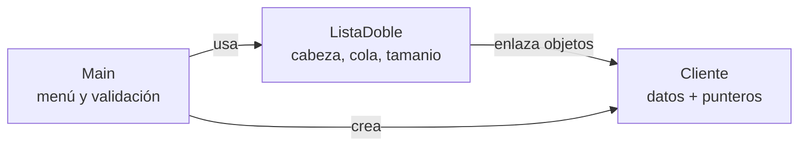

---

## 3. Cómo clonar el repositorio y trabajar con Git

### 3.1 Git y GitHub no son lo mismo

- **Git** es el programa que se instala en tu computador y lleva el **historial** de cambios
  del proyecto. Funciona sin internet.
- **GitHub** es el sitio web donde se guarda una **copia** de ese historial para que todos
  puedan verla y aportar. Es el "remoto".

En este proyecto el remoto se llama `origin` y apunta a:

```
https://github.com/ccastro2050/proyectoListasDoblesCabezaYCola.git
```

### 3.2 Preparación (solo la primera vez en cada computador)

Comprueba que Git esté instalado:

```bash
git --version
```

Si no aparece una versión, instálalo desde <https://git-scm.com/downloads>.

Después dile a Git quién eres. Este nombre y correo quedan escritos **dentro de cada
commit**, así que el profesor puede ver quién hizo cada cambio:

```bash
git config --global user.name "Tu Nombre"
git config --global user.email "tucorreo@ejemplo.com"
```

### 3.3 Clonar el repositorio

**Clonar** es descargar el proyecto **con todo su historial** y dejarlo conectado al remoto.
Se hace **una sola vez**:

```bash
git clone https://github.com/ccastro2050/proyectoListasDoblesCabezaYCola.git
cd proyectoListasDoblesCabezaYCola
```

Esto crea la carpeta del proyecto ya lista para compilar (ver la sección siguiente).

> **Clonar ≠ descargar el ZIP.** El ZIP de GitHub trae solo los archivos, sin historial y sin
> conexión al remoto: no podrás hacer `commit` ni `push`. Usa siempre `git clone`.

Para verificar que quedó bien conectado:

```bash
git remote -v      # debe mostrar la URL de origin (fetch y push)
git status         # debe decir "nothing to commit, working tree clean"
```

### 3.4 Las tres zonas de Git

Este es **el concepto que hay que entender**: un archivo modificado no viaja directo a
GitHub, sino que pasa por tres etapas.

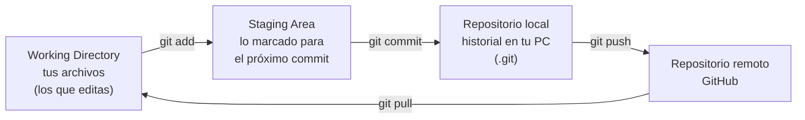

| Zona | Qué contiene | Cómo se ve |
|---|---|---|
| Working Directory | Los archivos tal como están en tu carpeta | `git status` |
| Staging Area | Lo que **elegiste** incluir en el próximo commit | `git diff --staged` |
| Repositorio local | Los commits ya guardados en tu PC | `git log` |
| Repositorio remoto | Los commits subidos a GitHub | La página del repo |

### 3.5 El ciclo de trabajo diario

Estos cinco comandos son el 90 % de lo que se usa en el curso:

```bash
git pull                             # 1. traer lo último de GitHub ANTES de empezar
                                     # 2. ...editar el código...
git status                           # 3. ver qué archivos cambiaron
git add src/ListaDoble.java          # 4. marcar lo que quiero guardar
git commit -m "Agregar mostrarInverso a la lista"   # 5. guardar en el historial local
git push                             # 6. subirlo a GitHub
```

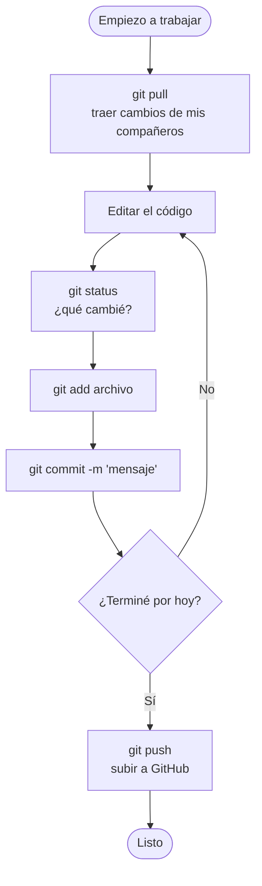

> **Regla de oro: siempre `git pull` antes de empezar.** Si dos personas editan el mismo
> archivo sin sincronizar, aparecen los conflictos. Traer primero los cambios ajenos evita
> la mayoría de los problemas.

### 3.6 Los comandos, uno por uno

| Comando | Para qué sirve |
|---|---|
| `git clone <url>` | Descargar el repositorio por primera vez. **Solo una vez.** |
| `git status` | Ver qué archivos cambiaron y en qué zona están. **El más usado.** |
| `git add <archivo>` | Marcar un archivo para el próximo commit. |
| `git add .` | Marcar **todos** los archivos cambiados. |
| `git commit -m "mensaje"` | Guardar los cambios marcados en el historial local. |
| `git push` | Subir tus commits a GitHub. |
| `git pull` | Traer y aplicar los commits de GitHub a tu copia. |
| `git log --oneline` | Ver el historial en una línea por commit. |
| `git diff` | Ver **qué** cambió, línea por línea, antes de hacer `add`. |
| `git restore <archivo>` | Descartar los cambios de un archivo y volver al último commit. |
| `git restore --staged <archivo>` | Sacar un archivo del staging (deshacer un `add`). |

**Sobre `git add .`:** es cómodo, pero agrega todo lo que haya cambiado, incluidos archivos
que no querías subir. Cuando puedas, nombra los archivos explícitamente.

**Sobre los mensajes de commit:** deben decir **qué se hizo**, en pocas palabras.

| Mal mensaje | Buen mensaje |
|---|---|
| `cambios` | `Corregir eliminar() cuando el nodo es la cola` |
| `asdf` | `Agregar validación de código duplicado en insertar` |
| `arreglos varios` | `Documentar los cuatro casos de eliminación en el README` |

### 3.7 Ver el historial

```bash
git log --oneline                    # una línea por commit
git log --oneline --graph --all      # con el dibujo de las ramas
git log -p src/ListaDoble.java       # historial de UN archivo, con sus cambios
git show e62b3e3                     # ver un commit concreto por su código
```

Cada commit tiene un identificador único (`e62b3e3`, por ejemplo). Con él puedes consultar
o recuperar cualquier estado anterior del proyecto: **nada de lo que se commitea se pierde**.

### 3.8 Trabajo en equipo: ramas

Una **rama** es una línea de trabajo paralela. Permite que cada estudiante desarrolle su
parte sin dañar el código que ya funciona en `main`.

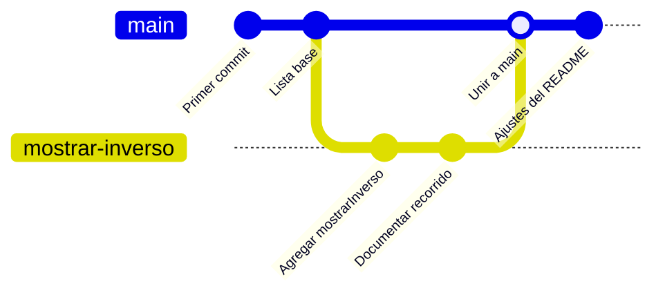

```bash
git branch                       # ver en qué rama estoy
git switch -c mostrar-inverso    # crear una rama nueva y moverme a ella
# ...trabajar, add, commit...
git push -u origin mostrar-inverso   # subir la rama por primera vez

git switch main                  # volver a la rama principal
git pull                         # actualizarla
git merge mostrar-inverso        # traer el trabajo de la rama a main
git push                         # subir el resultado
```

> En equipos suele preferirse subir la rama y abrir un **Pull Request** en GitHub, para que
> los compañeros revisen el código antes de unirlo a `main`.

### 3.9 El archivo `.gitignore`

No todo debe subirse a GitHub. Los archivos `.class` y la carpeta `out/` son **resultado de
compilar**: se regeneran con un `javac` y solo ensucian el repositorio. Por eso el proyecto
incluye un `.gitignore` en la raíz:

```gitignore
out/
*.class
```

**Regla práctica:** se sube el **código fuente**, nunca lo que se puede generar a partir de él.

### 3.10 Problemas frecuentes

**`! [rejected] main -> main (fetch first)` al hacer push.**
Alguien subió cambios después de tu último `pull`. Trae primero y vuelve a intentar:

```bash
git pull
git push
```

**Un conflicto (`CONFLICT (content): Merge conflict in ...`).**
Dos personas editaron las mismas líneas y Git no sabe cuál conservar. En el archivo aparecen
unas marcas:

```
<<<<<<< HEAD
    return (double) suma / tamanio;
=======
    return suma / count;
>>>>>>> otra-rama
```

Abre el archivo, **deja el código correcto y borra las tres marcas** (`<<<<<<<`, `=======`,
`>>>>>>>`). Después:

```bash
git add <archivo>
git commit
```

**Me pide usuario y contraseña al hacer push.**
GitHub ya no acepta la contraseña de la cuenta. Hay que generar un **Personal Access Token**
en *GitHub → Settings → Developer settings → Personal access tokens* y usarlo como
contraseña. (La otra opción es configurar una llave SSH.)

**Hice cambios que no quiero conservar.**

```bash
git restore src/Main.java     # descarta lo NO commiteado de ese archivo
```

> Ojo: `git restore` **borra** el trabajo no guardado de ese archivo y no se puede deshacer.

**Quiero ver en qué me quedé.**

```bash
git status        # estado actual
git log --oneline -5   # los últimos 5 commits
```

---

## 4. Cómo compilar y ejecutar

Desde la carpeta `src`:

```bash
javac -encoding UTF-8 Cliente.java ListaDoble.java Main.java
java Main
```

O compilando a una carpeta aparte (más ordenado):

```bash
javac -encoding UTF-8 -d ../out Cliente.java ListaDoble.java Main.java
java -cp ../out Main
```

> **Tildes en la consola de Windows.** Si ves `Opci?n` o `Cr?dito` en lugar de
> `Opción` o `Crédito`, la consola no está en UTF-8. Ejecuta antes:
> ```
> chcp 65001
> ```
> El programa funciona igual; solo cambia cómo se dibujan las letras acentuadas.

> **Punto o coma decimal.** Al *escribir* un crédito se aceptan las dos formas
> (`1500.50` y `1500,50`). Al *mostrarlo*, Java usa el separador del idioma del sistema:
> en español aparece `1500,50`.

---

## 5. Conceptos fundamentales

### 5.1 ¿Qué es una lista enlazada?

Un **arreglo** guarda sus elementos pegados en memoria, uno detrás del otro. Para insertar
en la mitad hay que correr todos los demás, y su tamaño es fijo.

Una **lista enlazada** no necesita que los elementos estén juntos. Cada elemento se llama
**nodo** y guarda dos cosas: sus **datos** y la **dirección** del siguiente nodo. Los nodos
pueden estar dispersos por la memoria; lo que los mantiene en orden son las flechas.

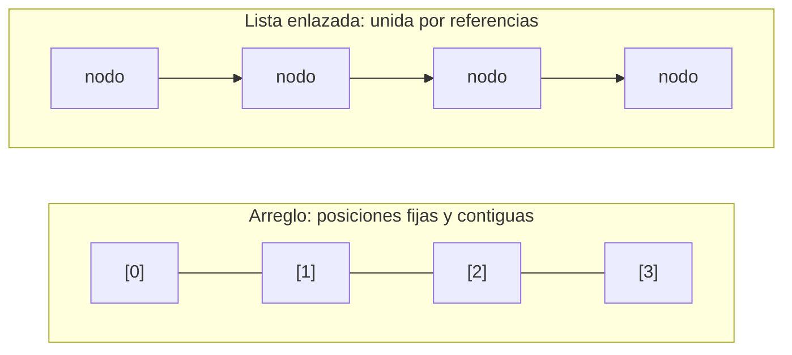

### 5.2 Simple vs. doble

| | Lista **simple** | Lista **doble** |
|---|---|---|
| Punteros por nodo | 1 (`siguiente`) | 2 (`siguiente` y `anterior`) |
| Recorrido | Solo hacia adelante | **En los dos sentidos** |
| Eliminar un nodo | Hay que recordar el anterior | El nodo ya conoce a su anterior |
| Memoria | Menos | Un puntero más por nodo |

Ese puntero extra es exactamente lo que hace posible el método `mostrarInverso()` y lo que
simplifica `eliminar()`.

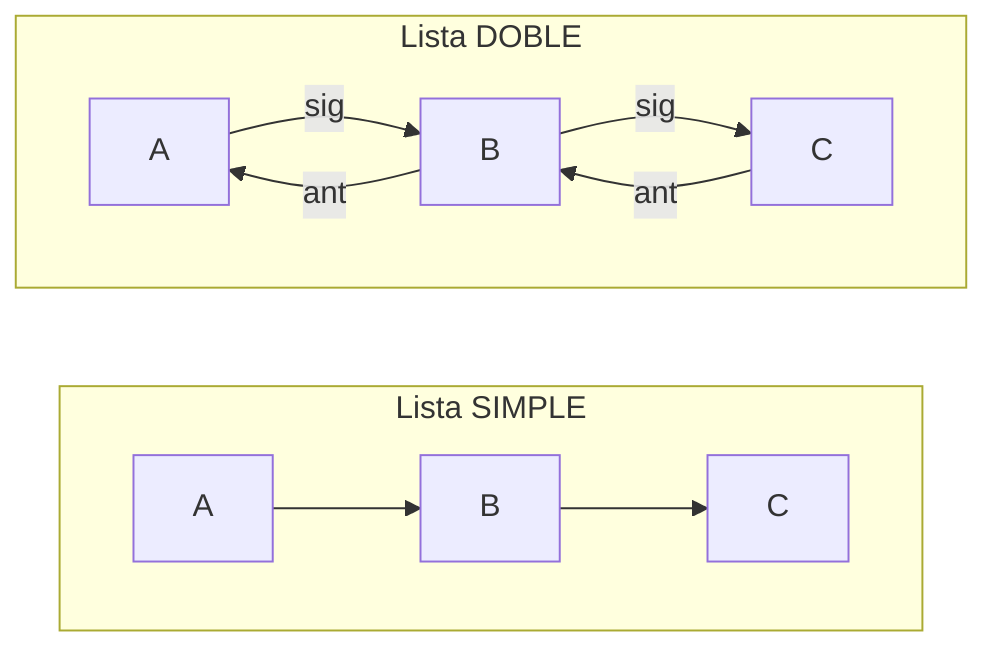

### 5.3 Cabeza y cola

- **Cabeza (`cabeza`)**: referencia al **primer** nodo. Es la puerta de entrada a la lista;
  si se pierde, se pierde la lista entera.
- **Cola (`cola`)**: referencia al **último** nodo. No es obligatoria, pero permite
  **insertar al final sin recorrer nada**.

Sin la cola, insertar al final costaría recorrer los *n* nodos cada vez. Con la cola, es
un salto directo.

### 5.4 `null`: dónde termina la lista

`null` significa "no apunta a nada". Se usa como **señal de borde**:

- `cabeza == null` → la lista está **vacía**.
- `nodo.anterior == null` → ese nodo es la **cabeza**.
- `nodo.siguiente == null` → ese nodo es la **cola**.

Y es la condición que detiene todos los recorridos: `while (aux != null)`.

### 5.5 El puntero auxiliar `aux`

Para recorrer **nunca** se mueve `cabeza`, porque perderíamos el inicio de la lista. Se usa
una variable temporal:

```java
Cliente aux = cabeza;      // 1. copia de la referencia, no del objeto
while (aux != null) {      // 2. mientras no se acabe la lista
    // ...usar aux...
    aux = aux.siguiente;   // 3. avanzar un eslabón
}
```

### 5.6 Estructura completa en memoria

Así se ve la lista con tres clientes:

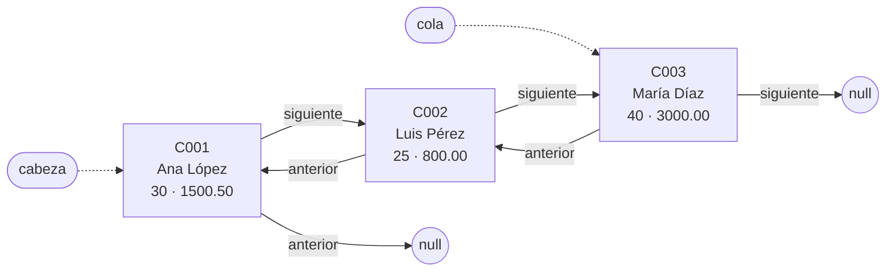

---

## 6. Anatomía del nodo: la clase `Cliente`

En este proyecto **el cliente *es* el nodo**: la misma clase guarda los datos y los enlaces.
Por eso no existe una clase `Nodo` separada.

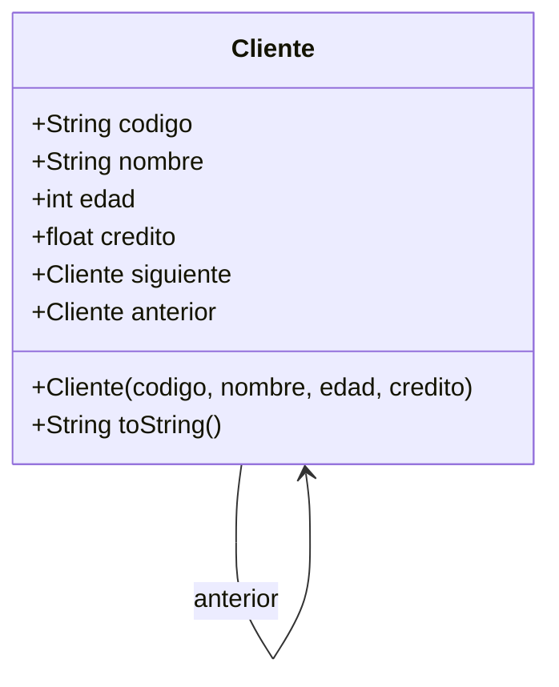

Un nodo dibujado por dentro:

```
 ┌──────────┬────────────────────────┬───────────┐
 │ anterior │  codigo, nombre,       │ siguiente │
 │          │  edad, credito         │           │
 └──────────┴────────────────────────┴───────────┘
      ▲              datos                  │
      └── al nodo previo      al siguiente ─┘
```

### `toString()` explicado

Java le da a toda clase un `toString()` que, por defecto, imprime algo inútil como
`Cliente@3a5b7c8d` (la dirección de memoria). Con `@Override` lo reemplazamos por uno legible:

```java
@Override
public String toString() {
    return String.format("[Codigo: %-6s | Nombre: %-15s | Edad: %3d | Crédito: %.2f]",
            codigo, nombre, edad, credito);
}
```

| Marca | Significado |
|---|---|
| `%-6s` | texto alineado a la **izquierda** en 6 espacios |
| `%3d` | entero alineado a la **derecha** en 3 espacios |
| `%.2f` | decimal con exactamente 2 cifras |

Gracias a esto, `System.out.println("  v  " + aux)` imprime el cliente completo: Java ve un
objeto en una concatenación de texto y llama a su `toString()` automáticamente.

---

## 7. La clase `ListaDoble`

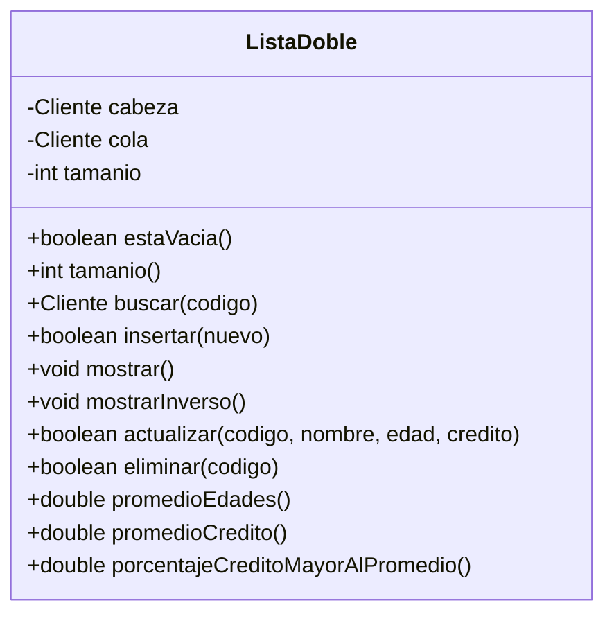

Los tres atributos son **privados** (`private`): nadie fuera de la clase puede dejar la
cabeza y la cola en un estado inconsistente. A eso se le llama **encapsulamiento**.

El campo `tamanio` se actualiza en `insertar()` y `eliminar()`, así que contar clientes es
inmediato en lugar de tener que recorrer la lista.

---

## 8. Operación por operación (con diagramas)

### 8.1 `buscar(codigo)` — la base de todo

Recorre desde la cabeza y devuelve el cliente cuyo código coincide, o `null`.

```java
public Cliente buscar(String codigo) {
    Cliente aux = cabeza;
    while (aux != null) {
        if (aux.codigo.equalsIgnoreCase(codigo)) return aux;
        aux = aux.siguiente;
    }
    return null;
}
```

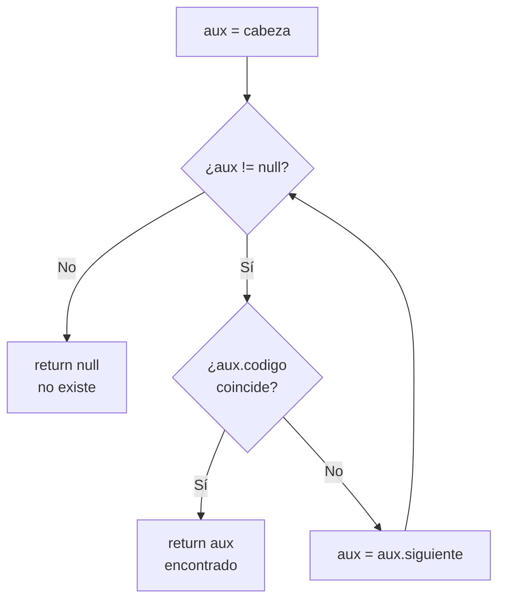

> **¿Por qué `equalsIgnoreCase` y no `==`?**
> En Java, `==` sobre objetos compara **direcciones de memoria**, no contenido. Dos textos
> distintos con las mismas letras darían `false`. `equals` compara letra por letra, y
> `equalsIgnoreCase` además ignora mayúsculas, para que `c001` y `C001` sean el mismo cliente.

Escribir la búsqueda **una sola vez** evita repetir el mismo `while` en `insertar`,
`actualizar` y `eliminar`. Es la razón por la que esos tres métodos son tan cortos.

### 8.2 `insertar(nuevo)` — agregar al final

Primero se rechaza un código repetido (el código es la identidad del cliente: con dos
iguales, `actualizar` y `eliminar` no sabrían a cuál se refiere el usuario). Luego hay
**dos casos**:

**Caso A — la lista está vacía.** El nuevo cliente es cabeza y cola a la vez.

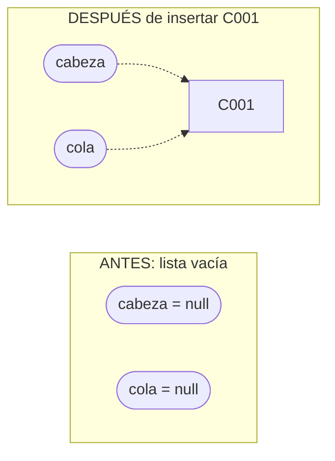

**Caso B — la lista ya tiene clientes.** Tres pasos, **en este orden**:

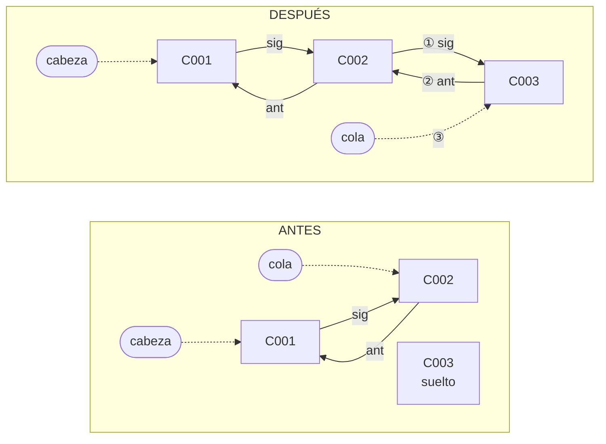

```java
cola.siguiente = nuevo;   // ① la cola actual apunta hacia adelante al nuevo
nuevo.anterior = cola;    // ② el nuevo apunta hacia atrás a la cola actual
cola = nuevo;             // ③ el nuevo pasa a ser la nueva cola
```

> **El orden importa.** Si se hiciera `cola = nuevo` primero, se perdería la referencia a la
> cola vieja y ya no habría a quién enlazar: la lista quedaría partida en dos.

### 8.3 `mostrar()` y `mostrarInverso()` — los dos recorridos

Idénticos salvo dos detalles: desde dónde arrancan y qué puntero siguen.

```java
// Hacia adelante                    // Hacia atrás
Cliente aux = cabeza;                Cliente aux = cola;
while (aux != null) {                while (aux != null) {
    System.out.println(aux);             System.out.println(aux);
    aux = aux.siguiente;                 aux = aux.anterior;
}                                    }
```

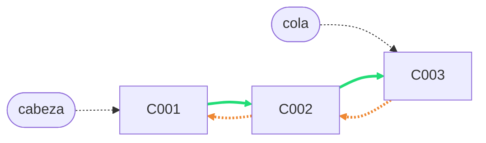

La línea verde es `mostrar()` (siguiendo `siguiente`); la naranja es `mostrarInverso()`
(siguiendo `anterior`). **Esta es la ventaja concreta de la lista doble**: en una lista
simple, recorrer al revés obligaría a invertir la lista o a recorrerla entera por cada
elemento.

### 8.4 `actualizar(...)` — modificar por código

```java
Cliente cliente = buscar(codigo);
if (cliente == null) return false;   // no existe

cliente.nombre  = nuevoNombre;       // el código NO se toca:
cliente.edad    = nuevaEdad;         // es la identidad del cliente
cliente.credito = nuevoCredito;
return true;
```

Actualizar **no toca ningún puntero**: el nodo sigue exactamente en el mismo lugar de la
cadena, solo cambian sus datos internos.

### 8.5 `eliminar(codigo)` — los cuatro casos

Eliminar en una lista enlazada **no es borrar memoria**: es hacer que los vecinos del nodo
se apunten entre ellos, "saltándoselo". Al quedar sin nadie que lo referencie, el
**recolector de basura** de Java lo libera solo.

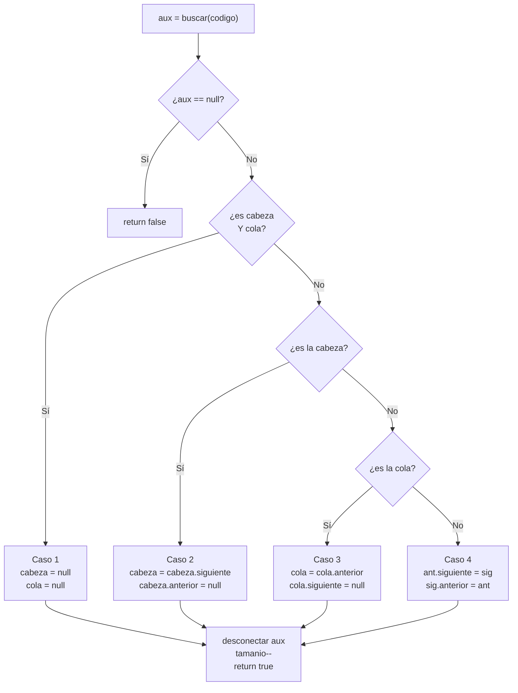

**Caso 1 — es el único cliente.** La lista queda vacía.

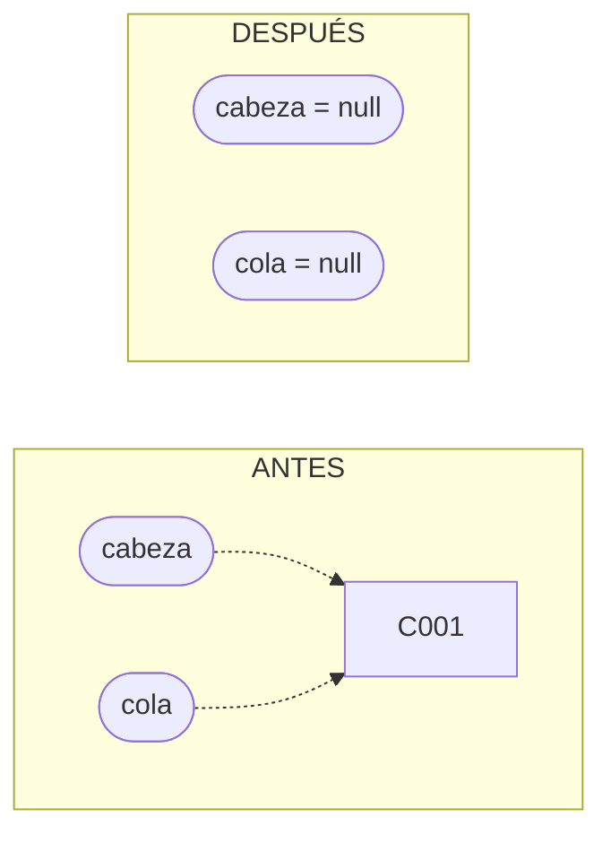

**Caso 2 — es la cabeza.** La cabeza avanza y la nueva cabeza pierde su `anterior`.

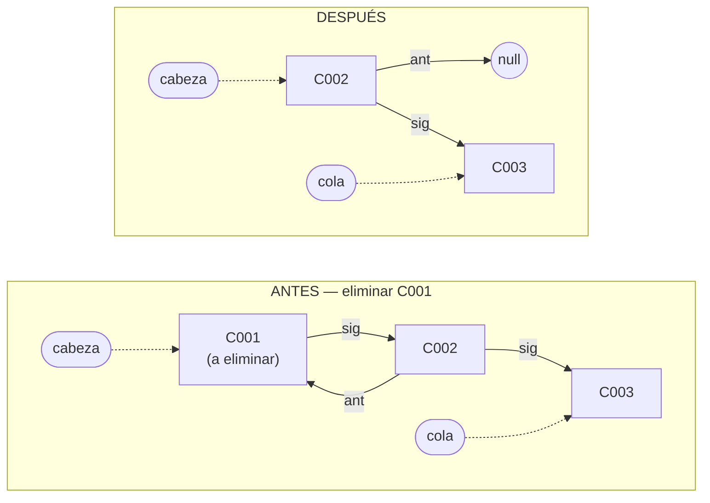

**Caso 3 — es la cola.** Simétrico al anterior: la cola retrocede y pierde su `siguiente`.

**Caso 4 — está en medio.** Los dos vecinos se enlazan directamente entre sí.

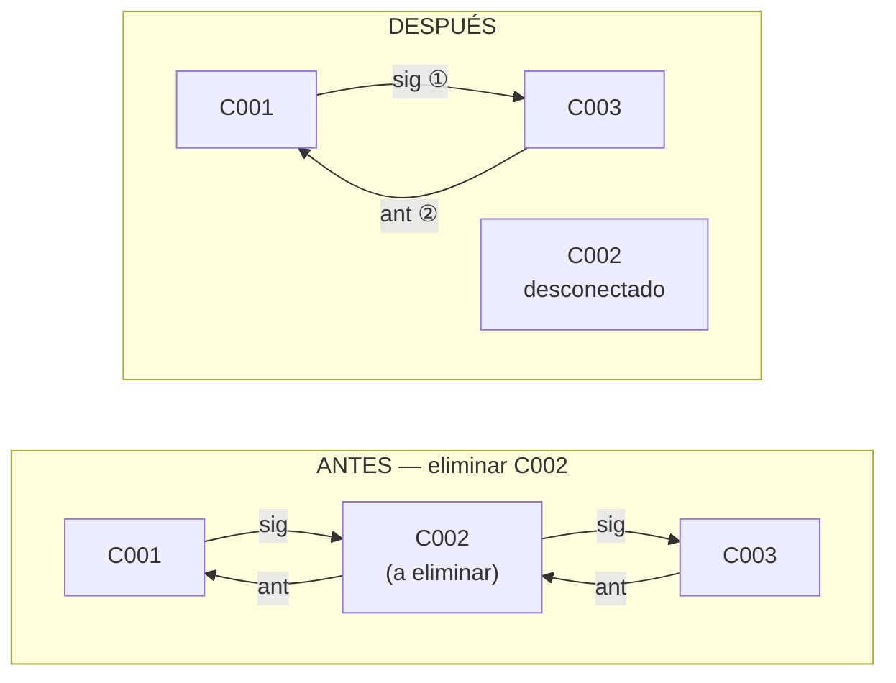

```java
aux.anterior.siguiente = aux.siguiente;   // ① el de la izquierda salta al de la derecha
aux.siguiente.anterior = aux.anterior;    // ② el de la derecha salta al de la izquierda
```

Y al final, en **todos** los casos:

```java
aux.siguiente = null;   // el nodo eliminado se desconecta por completo
aux.anterior  = null;   // así no puede "volver a entrar" a la lista por error
tamanio--;
```

---

## 9. Los cálculos estadísticos

### 9.1 `promedioEdades()`

Un solo recorrido acumulando edades, y una división al final:

```java
if (estaVacia()) return 0;   // sin clientes no hay promedio (¡evita dividir entre 0!)

Cliente aux = cabeza;
int suma = 0;
while (aux != null) {
    suma += aux.edad;
    aux = aux.siguiente;
}
return (double) suma / tamanio;
```

> **El `(double)` es obligatorio.** `suma` y `tamanio` son `int`, y en Java `int / int` da
> un `int`: `25 / 2` daría **12**, no 12.5. El *cast* convierte la suma en decimal antes de
> dividir, y así la división también es decimal.

### 9.2 `porcentajeCreditoMayorAlPromedio()`

Necesita **dos recorridos, y en este orden**:

1. Uno para conocer el promedio → lo hace `promedioCredito()`.
2. Otro para contar cuántos lo superan.

No se puede en uno solo, porque el promedio depende de **todos** los clientes, incluidos los
que todavía no se han leído.

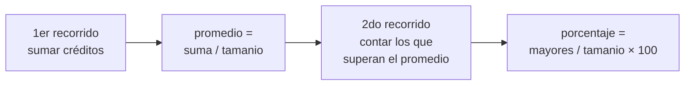

**Ejemplo numérico** con los tres clientes de arriba:

| Cliente | Crédito | ¿Supera el promedio? |
|---|---|---|
| C001 Ana | 1500.50 | No |
| C002 Luis | 800.00 | No |
| C003 María | 3000.00 | **Sí** |

- Suma = 1500.50 + 800.00 + 3000.00 = **5300.50**
- Promedio = 5300.50 / 3 = **1766.83**
- Superan el promedio: **1** de 3
- Porcentaje = 1 / 3 × 100 = **33.33 %**

Que es exactamente lo que imprime el programa.

---

## 10. Flujo del programa (`Main`)

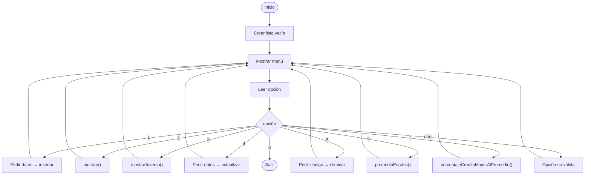

### 10.1 Por qué `do-while`

```java
do {
    // mostrar menú y ejecutar la opción
} while (opcion != 8 && !finDeEntrada);
```

Un `do-while` ejecuta su cuerpo **al menos una vez** y evalúa la condición al final. Es lo
ideal para un menú: siempre queremos mostrarlo antes de preguntarnos si el usuario quiere salir.

### 10.2 Cómo se leen los datos (y el error clásico que se evita)

Todo se lee con `nextLine()` (una línea completa) y luego se convierte con `Integer.parseInt()`
o `Float.parseFloat()`.

> **El error clásico de `Scanner`.** `nextInt()` lee el número pero **deja el salto de línea
> `\n` sin consumir** en el buffer. El siguiente `nextLine()` encuentra ese `\n` y devuelve
> una línea **vacía** de inmediato, sin dejar escribir al usuario. La solución habitual es
> agregar un `sc.nextLine()` extra "para limpiar". Leyendo **siempre líneas completas**, el
> problema simplemente no existe.

Cada dato se pide dentro de un bucle que **repite la pregunta hasta recibir algo válido**:

```java
private static int leerEntero(String mensaje) {
    while (!finDeEntrada) {
        String texto = leerLinea(mensaje);
        if (finDeEntrada) break;
        try {
            return Integer.parseInt(texto);
        } catch (NumberFormatException e) {
            System.out.println("  * Escribe un número entero válido.");
        }
    }
    return 0;
}
```

**`try-catch`** es una red de seguridad: si `parseInt` recibe `"hola"`, lanza una
`NumberFormatException`. Sin el `catch`, el programa se cerraría con un error feo; con él,
se muestra un mensaje y se vuelve a preguntar.

Validaciones aplicadas:

| Dato | Regla |
|---|---|
| Código | No puede quedar vacío. No puede estar repetido. |
| Nombre | No puede quedar vacío. |
| Edad | Número entero entre 0 y 120. |
| Crédito | Número decimal, no negativo. Acepta `1500.50` y `1500,50`. |
| Opción | Número entero; fuera de 1–8 avisa "Opción no válida". |

Y `hasNextLine()` detecta el **fin de la entrada** (Ctrl+Z en Windows, Ctrl+D en Linux/Mac,
o un archivo de entrada que se acabó) para cerrar el programa limpiamente en lugar de
reventar con `NoSuchElementException`.

---

## 11. Ejemplo de ejecución real

Insertando tres clientes y usando las opciones 7, 5, 2 y 6 (el menú se omite para abreviar):

```text
Opción: 1
Código: C001
Nombre: Ana Lopez
Edad: 30
Crédito: 1500.50
Cliente insertado.

Opción: 1
Código: C002
Nombre: Luis Perez
Edad: 25
Crédito: 800
Cliente insertado.

Opción: 1
Código: C003
Nombre: Maria Diaz
Edad: 40
Crédito: 3000
Cliente insertado.

Opción: 2
CABEZA
  v  [Codigo: C001   | Nombre: Ana Lopez       | Edad:  30 | Crédito: 1500,50]
  v  [Codigo: C002   | Nombre: Luis Perez      | Edad:  25 | Crédito: 800,00]
  v  [Codigo: C003   | Nombre: Maria Diaz      | Edad:  40 | Crédito: 3000,00]
COLA   (3 cliente(s))

Opción: 3
COLA
  ^  [Codigo: C003   | Nombre: Maria Diaz      | Edad:  40 | Crédito: 3000,00]
  ^  [Codigo: C002   | Nombre: Luis Perez      | Edad:  25 | Crédito: 800,00]
  ^  [Codigo: C001   | Nombre: Ana Lopez       | Edad:  30 | Crédito: 1500,50]
CABEZA (3 cliente(s))

Opción: 7
Crédito promedio: 1766,83
Clientes con crédito mayor al promedio: 33,33%

Opción: 5
Código a eliminar: C002
Cliente eliminado.

Opción: 2
CABEZA
  v  [Codigo: C001   | Nombre: Ana Lopez       | Edad:  30 | Crédito: 1500,50]
  v  [Codigo: C003   | Nombre: Maria Diaz      | Edad:  40 | Crédito: 3000,00]
COLA   (2 cliente(s))

Opción: 6
Promedio de edades: 35,00 años

Opción: 8
Saliendo...
```

Fíjate en el **caso 4 de `eliminar`**: al borrar C002 (un nodo intermedio), C001 y C003
quedan enlazados directamente, y el recorrido inverso también seguiría funcionando.

Comportamiento ante errores:

```text
Opción: abc
  * Escribe un número entero válido.
Opción: 9
Opción no válida. Elige un número del 1 al 8.

Opción: 1
Código: C001
Nombre: Repetido
Edad: 50
Crédito: 10
Ya existe un cliente con el código C001.
```

---

## 12. Costo de cada operación

*n* = cantidad de clientes en la lista.

| Operación | Costo | Por qué |
|---|---|---|
| `estaVacia()`, `tamanio()` | **O(1)** | Solo leen un atributo. |
| `buscar(codigo)` | **O(n)** | En el peor caso recorre toda la lista. |
| `insertar(nuevo)` | **O(n)** | El enlace en sí es O(1) gracias a `cola`; lo que cuesta es verificar que el código no esté repetido. |
| `mostrar()` / `mostrarInverso()` | **O(n)** | Visitan cada nodo una vez. |
| `actualizar(...)` | **O(n)** | Buscar es O(n); cambiar los datos, O(1). |
| `eliminar(codigo)` | **O(n)** | Buscar es O(n); desenlazar, O(1). |
| `promedioEdades()` / `promedioCredito()` | **O(n)** | Un recorrido. |
| `porcentajeCreditoMayorAlPromedio()` | **O(n)** | Dos recorridos: 2n sigue siendo O(n). |

> **Detalle importante para sustentar.** Enlazar al final es **O(1)** precisamente porque
> existe la referencia `cola`. Sin ella habría que recorrer la lista hasta el final en cada
> inserción. Que `insertar()` termine siendo O(n) se debe a la **validación de código
> repetido**, no al enlace: es un costo que se paga a cambio de garantizar que los códigos
> sean únicos.

---

## 13. Preguntas frecuentes

**¿Por qué `Cliente` es a la vez cliente y nodo?**
Para simplificar. La alternativa clásica es una clase `Nodo` que *contenga* un `Cliente`
(`Nodo { Cliente dato; Nodo siguiente, anterior; }`), lo cual separa mejor "el dato" de "la
estructura" y permite reutilizar la lista con cualquier tipo. Aquí se fusionaron para que
haya menos piezas que seguir.

**¿Por qué `cabeza` y `cola` son `private`?**
Encapsulamiento: si fueran públicas, cualquiera podría escribir `lista.cabeza = null` y dejar
la lista rota (con `tamanio` mintiendo y nodos huérfanos). Al ser privadas, la única forma de
modificar la lista es a través de sus métodos, que sí mantienen todo consistente.

**¿Por qué `insertar` devuelve `boolean`?**
Para poder avisar cuando el código ya existe. `ListaDoble` **decide**, y `Main` **informa**:
la estructura de datos no imprime nada, y la interfaz no manipula punteros.

**¿Qué pasa si elimino el único cliente de la lista?**
Es el Caso 1: `cabeza` y `cola` vuelven a `null` y la lista queda vacía. Volver a insertar
funciona con normalidad (entra por el Caso A de `insertar`).

**¿Se libera la memoria del cliente eliminado?**
Java no tiene `free()` ni `delete`. Cuando ya nadie tiene una referencia al objeto, el
**recolector de basura** (*garbage collector*) lo libera automáticamente. Por eso, además de
desenlazarlo de sus vecinos, se ponen sus propios punteros en `null`.

**¿Por qué el promedio devuelve 0 si la lista está vacía?**
Porque dividir entre 0 no tiene sentido. Es una **guarda**: se detecta el caso especial
*antes* de hacer el cálculo. `Main` además avisa "No hay clientes registrados" en lugar de
imprimir un 0 confuso.

**¿Podría insertar al inicio o en una posición específica?**
Sí, y sería el complemento natural de este proyecto. Insertar al inicio es simétrico a
insertar al final: se enlaza con `cabeza` en lugar de con `cola`, y también cuesta O(1).
